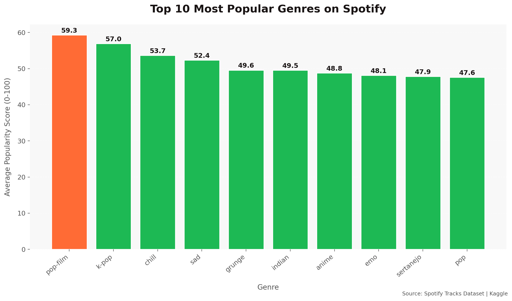
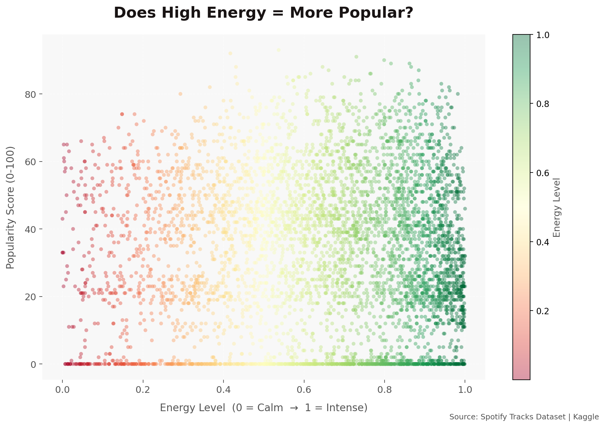
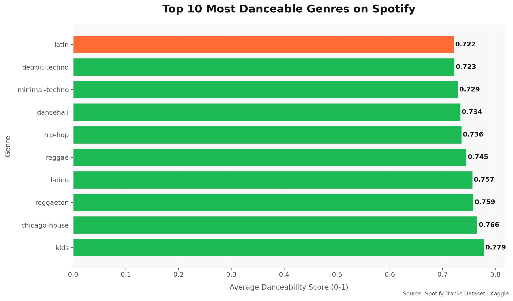

# 🎵 Spotify Data Analysis

Exploratory data analysis of 114,000 Spotify tracks using Python.

## 📊 Insights Found

| # | Insight |
|---|---------|
| 1 | Pop-film is the most popular genre on Spotify |
| 2 | High energy songs appear more frequently than calm ones |
| 3 | Latin is the most danceable genre on Spotify |

## 📈 Charts

## 🛠️ Tools Used
- Python
- Pandas
- Matplotlib
- Kaggle

## 📁 Dataset
[Spotify Tracks Dataset — Kaggle](https://www.kaggle.com/datasets/maharshipandya/-spotify-tracks-dataset)
